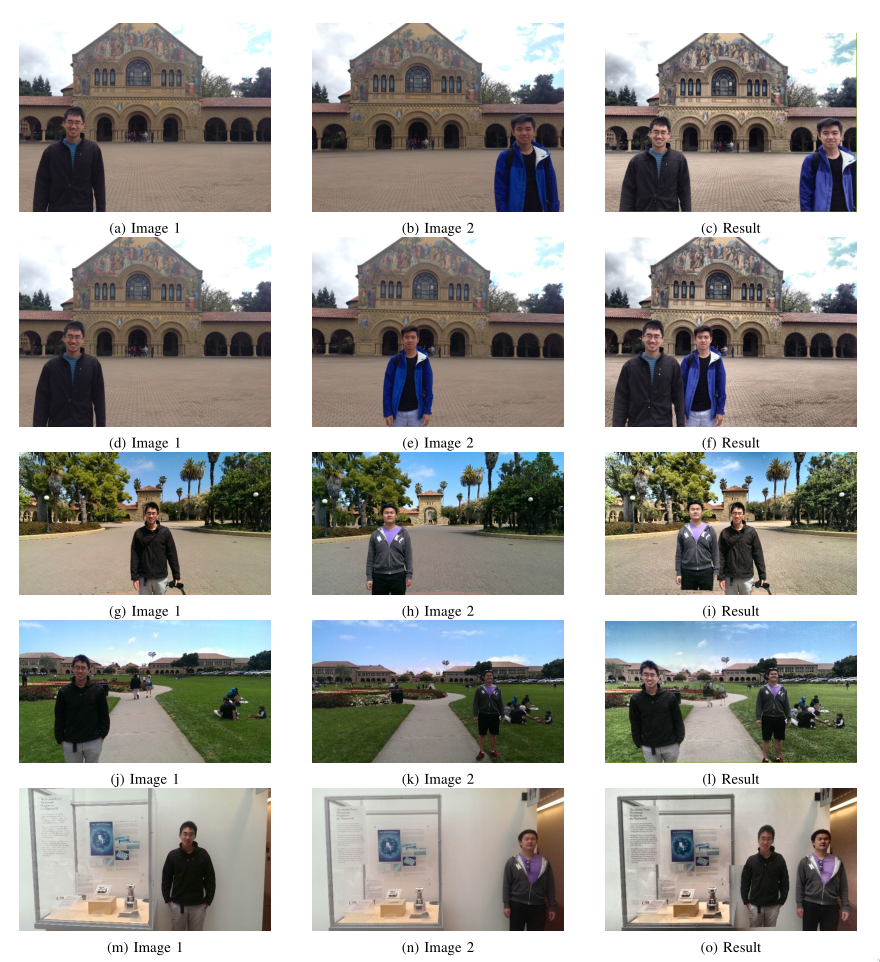

# Project Proposal for team APPY FIZZ

## Project ID and title
| Key | Value |
| --- | :---: |
| Project ID |15 |
| Project Title | Friend Blend |

## GitHub link
https://github.com/Digital-Image-Processing-IIITH/project-appy-fizz

## Team members
 - Ahish Deshpande
 - Pranav Kirsur
 - Pranav Tadimeti
 - Yoogottam Khandelwal

## Main goals of the project
Our goal is to implement "FriendBlend, a mobile application that merges two portraits of different people to create a single, multi-person photo. To do this, Person A takes a photo of Person B, and Person B takes a photo of Person A with the same background.  Given these two input images, our goal is to create a third image with both Person A and Person B in the photo together." [1]

## Problem definition
TODO: add textual description for each sub point

Steps:
1. Color correction
2. Face and body detection [+]
3. Homography estimation  
  a. Keypoint detection  
  b. Keypoint matching  
  c. Computing the homography
4. Image blending [+]  
  a. Subjects far apart  
  b. Subjects closer together

## Results of the project
TODO: add textual description

## Project milestones and expected timeline
| 19th Oct - 22nd Oct | color correction |
| 23rd Oct - 26th Oct | face and body detection |
| 27th Oct - 3rd Nov | Homography estimation |
| 31st Oct | MID EVALUATION |
| 4th Nov - 8th Nov | Image blending |
| 8th Nov - 16th Nov | Buffer period for squashing potential bugs, optimizing the pipeline, working on the presentation |
| 17th Nov - 18th Nov| Final Review and finishing touches. |
| 19th Nov | FINAL EVALUATION |

## Dataset Requirement
We will not be needing any dataset.

### References
 - [1]  Kevin Chen, David Zeng, Jeff Han _FriendBlend_  
[https://web.stanford.edu/class/ee368/Project\_Spring\_1415/Reports/Chen\_Zeng.pdf](https://web.stanford.edu/class/ee368/Project_Spring_1415/Reports/Chen_Zeng.pdf)
