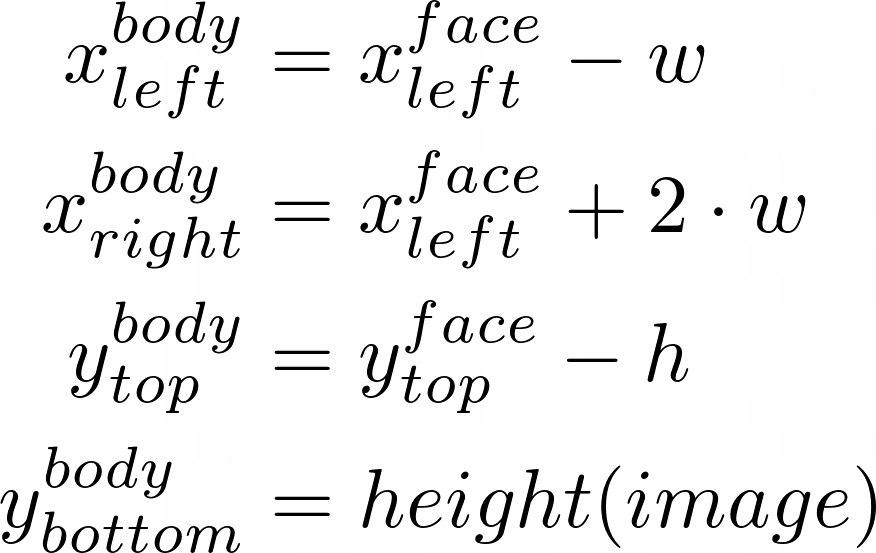
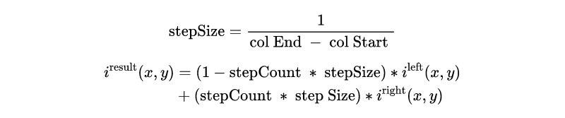

# Project Proposal for team APPY FIZZ

## Project ID and title
|  |  |
| --- | :---: |
| Project ID |15 |
| Project Title | Friend Blend |

## GitHub link
https://github.com/Digital-Image-Processing-IIITH/project-appy-fizz

## Team members
 - Ahish Deshpande
 - Pranav Kirsur
 - Pranav Tadimeti
 - Yoogottam Khandelwal

## Main goals of the project
Our goal is to implement "FriendBlend, a mobile application that merges two portraits of different people to create a single, multi-person photo. To do this, Person A takes a photo of Person B, and Person B takes a photo of Person A with the same background.  Given these two input images, our goal is to create a third image with both Person A and Person B in the photo together." [1]

## Problem definition

Given two input images, our goal is to create a third image with both Person A and Person B in the photo together. We first color correct the photos and then register the images by performing keypoint matching to estimate the homography. We then blend the images either by alpha blending or by GrabCut segmentation, depending upon the relative locations of the human subjects in the two images. 

Steps:
1. Color correction
2. Face and body detection 
3. Homography estimation  
  a. Keypoint detection  
  b. Keypoint matching  
  c. Computing the homography
4. Image blending 
  a. Subjects far apart  
  b. Subjects closer together

### Color Correction
In this step, we try our best to match the lighting and contrast of the two images so that once the images are blended, they look uniform. Contrast limited histogram equalization is used to facilitate this process.

### Face and Body Detection
This is a crucial step as we need to be able to know where the subjects in the images are located. To perform the detection, we use the Haar Cascade Classifier which gives us the coordinates of the face in the image. We then use the following formulas, also mentioned in the paper, to calculate the bounding box for the body:

### Homography Estimation
In this step, we estimate the relative transform between the common points of one image to the other. This is done by first finding the correspondences between the two images, and then using that data to find the best transformation from one image to the other. This is popularly known as homography.

#### Keypoint Detection
For keypoint detection, we will be using the ORB (Oriented FAST and Rotated BRIEF) algorithm.

#### Keypoint Matching
Keypoints in the two images are matched by Hamming distance which is recommended for ORB descriptors. A pair of keypoints, one from each image, are said to be matched if the keypoints are within a certain threshold hamming distance from each other. It is crucial to perform this step as accurately as possible as it helps in finding the right homographic transform between the two images.

#### Homography Computation
Once we have found a good set of matching keypoints in the two images, we can use the RANSAC algorithm to find the homography that best warps the images into the same perspective. This is the most important step so far.

### Image Blending 
This is the step without which all the previous work done would amount to nothing. 

#### Subjects are Far Apart
When the subjects are far apart, we use alpha blending to merge the two images.

#### Subjects are Close Together

In this case, one friend is segmented on top of the other friend, making it look like one friend is standing in front of the other. To determine which friend is in front, we compare the sizes of the face bounding boxes of each friend and set the friend corresponding to the larger face to be in the foreground.
Once we have determined which friend is in front, we need to crop the person in the foreground. We use GrabCut to obtain a crop of the chosen friend. Once this is done, we use the result to obtain a mask of the chosen friend. Erosion is then performed to remove extraneous artifacts along the edges of the mask. FInally, this mask is overlaid on the background image to obtain the final result.

## Results of the project

1. In the first row, we can see that the friends were far apart and alpha blending was used.
2. In the second case, the friends were close and grabcut was used.
3. The next 3 examples show the algorithm’s output in different locations
4. The color correction is clearly visible in all the output images.
5. This algorithm, especially in the case of grabcut isn’t perfect. This is visible in the last image.

## Project milestones and expected timeline
| Date | Task |
| --- | --- |
| 19th Oct - 22nd Oct | Color correction |
| 23rd Oct - 26th Oct | Face and body detection |
| 27th Oct - 3rd Nov | Homography estimation |
| 31st Oct | MID EVALUATION |
| 4th Nov - 8th Nov | Image blending |
| 8th Nov - 16th Nov | Buffer period for squashing potential bugs, optimizing the pipeline, working on the presentation |
| 17th Nov - 18th Nov| Final Review and finishing touches. |
| 19th Nov | FINAL EVALUATION |

## Dataset Requirement
We will not be needing any dataset.

### References
 - [1]  Kevin Chen, David Zeng, Jeff Han _FriendBlend_  
[https://web.stanford.edu/class/ee368/Project\_Spring\_1415/Reports/Chen\_Zeng.pdf](https://web.stanford.edu/class/ee368/Project_Spring_1415/Reports/Chen_Zeng.pdf)
